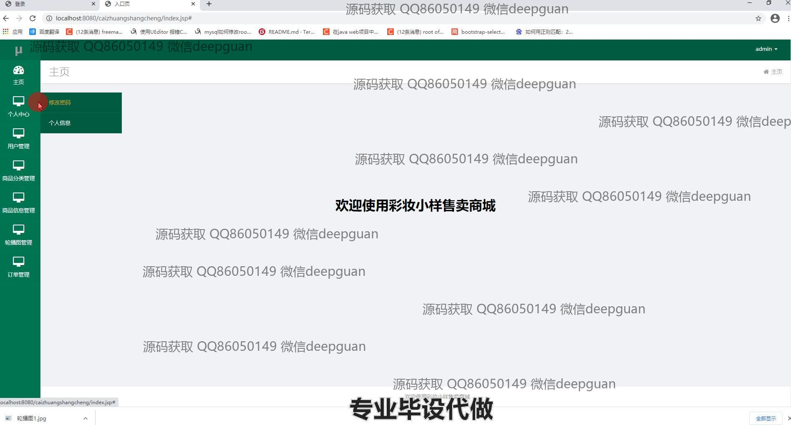
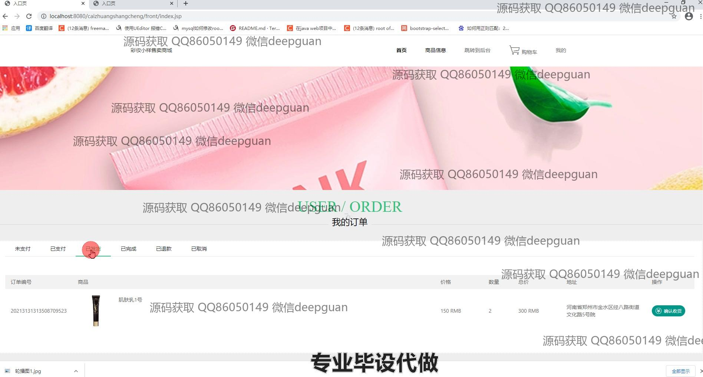

<h1 align="center">彩妆小样售卖商城的设计与实现</h1>

## 简介
化妆品小样售卖商城：角色分为管理员、用户；功能包括商品展示与管理、用户注册登录、订单管理、购物车功能、个人中心、积分优惠及支付结算。    --计算机毕业设计源码；毕设源码；java毕业设计源码

## 联系方式

<h3 align="center">获取完整代码与数据库文件 + 微信：deepguan QQ: 86050149 QQ群: 783742310</h3>

<h3 align="center">可帮忙远程部署 包运行成功！提供远程部署、修改代码、设计文档指导、代码讲解等服务！</h3>

## 功能介绍（完整见运行截图）
用户： 主页功能包括浏览商品信息和管理购物车，用户可进行商品搜索、商品详情查看，并通过购物车完成结算。个人中心允许查看和修改个人信息、管理订单、地址和收藏。支付功能支持积分优惠，并可选择不同的支付方式。

管理员： 后台管理系统包含用户管理、商品分类和信息管理、订单管理、轮播图管理等功能。商品管理中可以编辑商品信息、上下架商品并管理库存。订单管理页面提供订单查看、状态更新和处理功能，帮助管理员进行综合管理。

## 运行截图

本代码来源于网络,仅供学习参考使用!

